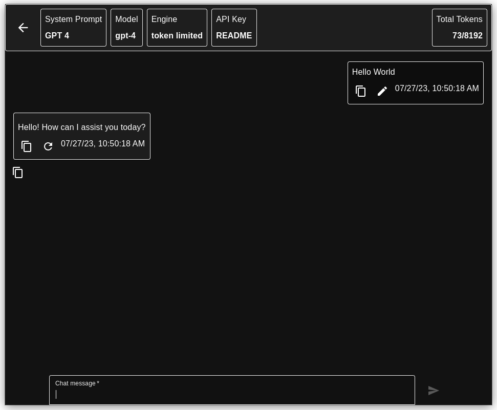

# Skyway

> A desktop chatbot interface featuring encryption and custom system prompts

[](https://opensource.org/licenses/MIT)



## Developer Quick Start

Prerequisites: Node 18 - no `.ENV` file

```npm i```
```npm start```

## Not-a-Developer Quick Start

Refer to [How do I get started using Skyway?](#how-do-i-start-using-skyway) below.

## FAQs

### What is Skyway?

Skyway is a desktop chatbot application powered by OpenAI models and APIs.

Skyway currently runs models such as `gpt-3.5-turbo` and `gpt-4`.

### Who is Skyway for?

Everyone!

You do not need to know how to code or be technically inclined to use Skyway.
If you have a desire to interact with a chatbot effectively and securely, Skyway is for you.

### How do I start using Skyway?

Obtain an API Key from OpenAI.
See [Is Skyway Free to Use?](#is-skyway-free-to-use) if you do not have a key.

Next, to install Skyway without using a terminal / command prompt,
see the [Precompiled Binaries](#precompiled-binaries) section below.
This is the easiest way to install Skyway. If you do not code, this is for you.

To start devloping with Skyway, see [Making, Building, and Installing](#making-building-and-installing).

### Is Skyway free to use?

Skyway is free to use and modify as you see fit.

In order to chat using Skyway, you must have an API Key from OpenAI.
Basic users can expect to pay $2 per month or less. More advanced users may see
higher token usage.

For more info see
[OpenAI Signup](https://github.com/0xbenc) | [Pricing](https://openai.com/pricing) | [Finding your API Key](https://help.openai.com/en/articles/4936850-where-do-i-find-my-secret-api-key)

### Why is there a password in Skyway?

One Skyway design goal is to encrypt the chats and prompts stored on your computer.

The password you create does not communicate with the internet; it decrypts the
data you generate when using Skyway.

### Why should I use Skyway vs ChatGPT?

- Customization via system prompts and engines
- Potential to develop integrations more securely than through a web service
- Data privacy

### What tech does Skyway use?

Skyway is an Electron app with a React frontend.
Electron Forge is used to simplify the make / build process.
Electron Store is used for persistent storage on the user's disk.

The UI is built with Material UI 5.

CryptoJS handles encryption. Zustand is used for state management.

Responses are powered by OpenAI chat completions APIs,
on models such as `gpt-3.5-turbo` and `gpt-4`.

### What systems does Skyway run on?

Mac, Windows 10 / 11, and Debian Linux (64bit) are officially supported.

ChromeOS is not officially supported, but many modern Chromebooks and Chromeboxes
can install .deb files from the Downloads folder.

Skyway is not a website or a native mobile app. To chat and receive messages,
an internet connection must be present.

The ARM64 architecture is officially supported for Windows, Mac
and Linux (M1, M2, Raspberry Pi 4, Jetson Nano, etc).

While Skyway does not have active Windows ARM (64bit) support, technical users
should be able to make / build for this platform with small modifications to the
Electron Forge configuration.

While only Debian (Ubuntu, PopOS, Raspberry Pi OS, etc) Linux builds are
officially supported, Skyway can be made / built / installed on most x86 *nix PCs.

### Does Skyway have an API? Can I use Skyway at scale?

Skyway does not provide an API of its own.

Skyway uses axios in the main electron thread to communicate with OpenAI APIs
and sends the response to the renderer with IPCHandlers.

This makes Skyway unfit for modification into large-scale projects.
OpenAI also places limits on the number of requests you can make per minute per key.

### What are Skyway's design goals?

- Intuitive UI with complete keyboard-only support
- No compromises between ease-of-use and inclusion of power tools
  - Should not confuse noobs
  - Should not hinder pros
- Multiple engines
  - Token-Limited (conversational, with memory)
  - Amnesia (one-shot, no memory)
- Encrypted chats / system prompts
- Easily exportable chats / system prompts

## Precompiled Binaries

### The easiest way to install Skyway

Go to the [Releases](https://github.com/0xbenc/skyway/releases) section of this repository.
Find the version with the 'Latest' tag.
Download the file appropriate for your platform.

- Mac
  - Darwin .zip file
  - After downloading
    - Double click to unzip
    - Drag app into `Applications` folder
    - Try to run app
    - If app will not run, allow app in system preferences -> security
- Linux
  - .deb file
  - see [Linux installer instructions](#linux-debian-x64--arm64) below
- Windows
  - .exe file
  - after downloading, double-click to run

## Making, Building, and Installing

### System prerequisites

- requires node 18.x on x86 Windows, Mac (Intel), and Linux (Debian)
- requires node 18.x on ARM Mac (M1, M2)
- requires node 18.x on ARM Windows
- requires node 16.x on ARM64 Linux (Debian)
- ARM32 Linux not supported
  - It is recommended you find a more lightweight project, with a non-web GUI

### NPM

To install dependencies:

```npm install```

### Running Skyway locally

Make sure you have installed dependencies first:

```npm run start```

### Building an installer file for Skyway

On x86 and ARM Mac:

```npm run makeMac```

Optionally, on ARM Mac:

```npm run makeMacARM```

On x86 Windows:

```npm run makeWindows```

On x86 Linux (Debian):

```npm run makeLinux```

On ARM Linux (Debian):

```npm run makeLinuxARM```

### Using the installer file for Skyway

Navigate to the `out/make` folder from the root of the project.
Inside `make` will be another folder based on the platform for which Skyway was built.
Navigate inside that folder, and navigate again inside the next folder.
You should be two levels down from `make`.

#### Windows (x64 + ARM64)

- Click the .exe file to begin the install process.
If Skyway was already installed, it will be updated.

#### Mac (x64 + ARM64)

- Unzip the zip file
- Drag the unzipped file into the `Applications` folder
- Launch the program from the Applications folder
or press `CMD` + `spacebar`
- Optionally, Skyway can be dragged or locked to the dock for convenience

#### Linux (Debian, x64 + ARM64)

- Use Eddy or "Software Store" install the .deb with a GUI
  - or
- In terminal, in the folder containing the .deb, run `sudo dpkg -i DEB_PACKAGE`
and replace `DEB_PACKAGE` with the name of the .deb file

## Code of Conduct

See the Skyway [Code of Conduct](./CODE_OF_CONDUCT.md).

## Contributing to Skyway

If you wish to write issues or develop features for Skyway, see [here](./CONTRIBUTING.md)!

## Contributors

- [0xbenc](https://github.com/0xbenc) - maintainer
